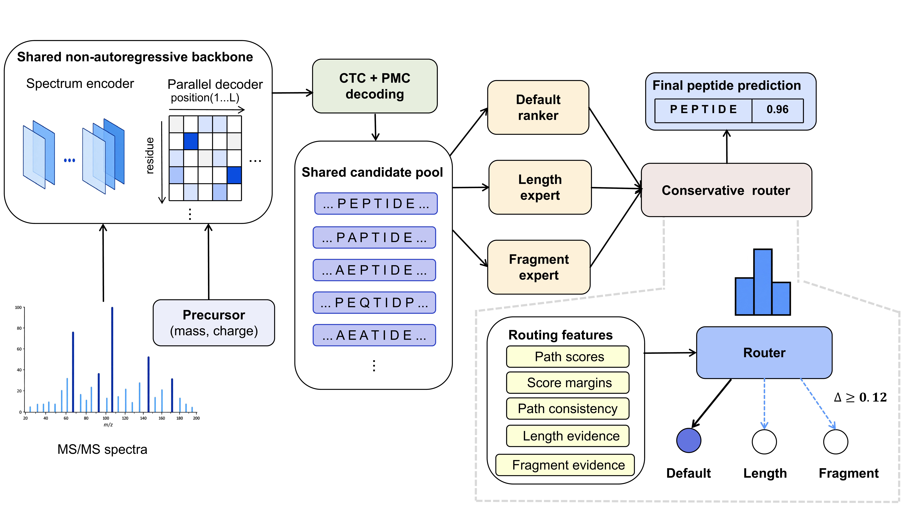

# pi-MNovo

pi-MNovo is a microbial-domain de novo peptide sequencing model for tandem
mass spectra. The release combines a non-autoregressive CTC backbone,
precise-mass-control candidate generation, three candidate-ranking paths, and
a conservative observable router in one inference entry point.

## Release status

This working tree contains the **unreleased 0.1.1.dev0 review corrections**.
It is not a new frozen manuscript release and has not reproduced the historical GPU benchmark.
See [review disposition](docs/CODE_REVIEW_20260907.md) for validation and open evidence.
The unchanged historical unified checkpoint is `pi-MNovo-v0.1.0.ckpt` with SHA256:

```text
1de589a887a7b7271aae794b90850ece6c3c68c6d085374d0b32e40ec18d617f
```

The checkpoint loads the backbone, default ranker, long-peptide expert,
fragment-evidence expert, length predictor, router, and score calibrator once.
Candidate generation is fixed to Beam5 plus PMC union. Experimental FDR and
dynamic Beam20 paths are not part of this release.

## How it works



An MS/MS spectrum and its precursor mass and charge are encoded once by a
shared non-autoregressive backbone. The parallel CTC decoder generates Beam5
candidates, while precise-mass-control decoding adds a mass-consistent candidate
to the same pool. A default ranker, a long-peptide expert, and a fragment-evidence
expert score the shared candidates. The conservative router retains the default
result unless an expert shows sufficient evidence under the frozen routing rule.
The selected peptide is reported with a calibrated `Score` between 0 and 1.

## System requirements

- Linux x86-64
- NVIDIA GPU with a CUDA 12 compatible driver
- Conda or Mamba
- Python 3.10

## Installation

```bash
git clone https://github.com/ye-jing-wen/pi-MNovo.git
cd pi-MNovo
conda env create -f environment.yml
conda activate pi-mnovo
pip install -e . --no-deps
```

The environment installs the bundled `ctcdecode` wheel for Python 3.10 on
Linux x86-64. It was built against PyTorch 2.5.1. Other platforms require rebuilding
[ctcdecode](https://github.com/parlance/ctcdecode) against the active PyTorch.

## Model checkpoint

The unified checkpoint is distributed as an asset of the
[v0.1.0 GitHub Release](https://github.com/ye-jing-wen/pi-MNovo/releases/tag/v0.1.0),
rather than being stored in the Git repository. Download and verify it with:

```bash
python scripts/download_model.py
```

By default, the checkpoint is saved as:

```text
models/pi-MNovo-v0.1.0.ckpt
```

The downloader verifies the file against the release SHA256 and removes an
incomplete or mismatched download. To use a different destination:

```bash
python scripts/download_model.py \
  --output /your/path/pi-MNovo-v0.1.0.ckpt
```

The checkpoint can also be downloaded directly from the
[release asset](https://github.com/ye-jing-wen/pi-MNovo/releases/download/v0.1.0/pi-MNovo-v0.1.0.ckpt).

## De novo prediction

The input can be one MGF file, a directory, or a case-insensitive MGF glob.
Runtime defaults are read from the checkpoint, so the performance parameters
do not need to be supplied on every invocation.

```bash
pi-mnovo \
  --model denovo \
  --input example.mgf \
  --output predictions.tsv
```

CUDA is selected automatically. Production inference requires an NVIDIA GPU.
Union inference now fails before loading weights if CUDA is unavailable.
For a diagnostic Beam5-only run, explicitly pass `--device cpu --candidate-mode beam-only`;
this changes the candidate algorithm and must not be compared as the frozen union system.
The ctcdecode extension is still required. PMC errors abort union inference.
TSV output appends `Status`, `Route`, and `dataset_index`; an empty pool reports
`no_valid_candidate`, route `none`, and Score 0 without ranking or calibration.

Directory and glob examples:

```bash
pi-mnovo --model denovo --input ./mgf --output predictions.tsv
pi-mnovo --model denovo --input './mgf/**/*.mgf' --output predictions.tsv
```

The output columns are:

```text
TITLE  Scan_No  Exp.MH+  Charge  Sequence  Calc.MH+
Mass_Shift(Exp.-Calc.)  Score  Modification
```

`Score` is a calibrated value in `[0, 1]`; larger values indicate higher
empirical confidence. The manuscript operating threshold is approximately
`0.92`. It is a confidence threshold, not an FDR estimate.

## Evaluation

Evaluation accepts the same input forms as prediction: a single MGF file, a
directory searched recursively, or a case-insensitive MGF glob. Every spectrum
must contain a `SEQ` field with its reference peptide.

```bash
pi-mnovo \
  --model eval \
  --input ./annotated_mgf \
  --output predictions.tsv \
  --metrics-output metrics.json
```

The reported peptide recall uses all parsed spectra as the denominator.

## Backbone training

Training accepts MGF files or globs for separate training, validation, and test
roles. Do not reuse evaluation peptides during model or threshold selection.

```bash
pi-mnovo \
  --model train \
  --input './train/**/*.mgf' \
  --validation-input './valid/**/*.mgf' \
  --test-input './test/**/*.mgf' \
  --config MNovo/config.yaml \
  --checkpoint path/to/initial_backbone.ckpt \
  --output runs/backbone
```

`MNovo/config.yaml` is the default portable configuration. The command-line
interface starts in de novo inference mode unless `--model eval` or
`--model train` is selected. By default, backbone training draws 500,000
spectra without replacement in each epoch; a new sample is drawn at the next
epoch. This budget can be changed with `train_num_samples` in the YAML. Training
logs, validation metrics, and checkpoints are written under the directory given
by `--output`. Dataset sampling, leakage control, and expert/ranker construction
used for manuscript reproduction are documented separately because they depend
on labelled training resources that are not distributed in this repository.

## Tests

```bash
pip install -r requirements-dev.txt
pytest -q
python scripts/verify_release.py --checkpoint models/pi-MNovo-v0.1.0.ckpt
```

## License and citation

The code is released under the MIT License. See `NOTICE` for upstream
attribution and `CITATION.cff` for citation metadata.

## Review correction utilities

`python scripts/audit_training_labels.py --labels labels.tsv --output audit.json`
audits explicit data roles, full CTC feasibility (including adjacent repeats),
unsupported labels and canonical-key intersections. Input columns are `role` and
`sequence`. This is an audit of supplied rows, not proof of historical exposure.

`python scripts/audit_checkpoint_metadata.py --checkpoint MODEL --report audit.json`
scans nested metadata. Add `--output NEW_CANDIDATE` to sanitize local paths and verify
all component tensors; it never overwrites or promotes an existing asset.

Training accepts only training and validation inputs. `--test-input`/`--peak_path_test`
is deprecated and ignored; evaluate final test only after all selection decisions freeze.
Unalignable training/validation loss targets now raise an error; audit and construct an
explicit eligible loss subset before fitting. Final recall continues to include all spectra.
`eval` rejects `--indices` and `--max-samples` rather than silently changing its denominator.

The supported full installation remains **source checkout (or sdist) + environment.yml on Linux
Python 3.10**, including the bundled native decoder. A standalone `pip install` of the
Python wheel does not install a complete sequencing environment. CPU invariant tests can
run without CuPy or ctcdecode; that is not an end-to-end inference certification.

Second audit corrections are recorded in [SECOND_AUDIT_20260907.md](docs/SECOND_AUDIT_20260907.md).
External inference `--config` files may override `runtime` controls only; frozen model,
preprocessing and residue fields must match the checkpoint. Singleton candidate pools
retain R1 without invoking the router. Prediction streams must match the requested
input indices and row count before the output file is published.
